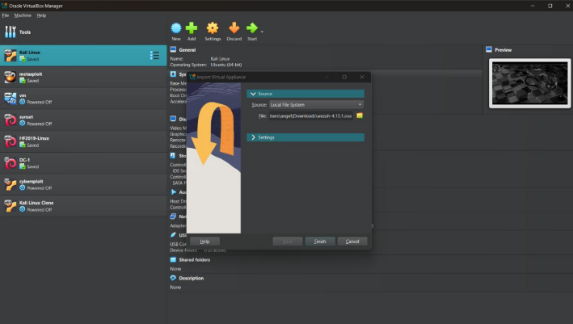
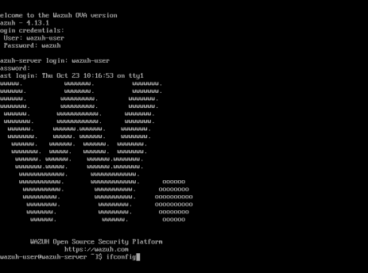
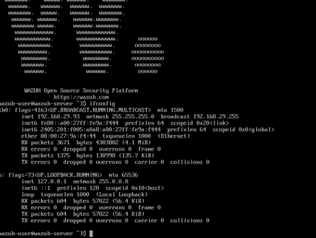
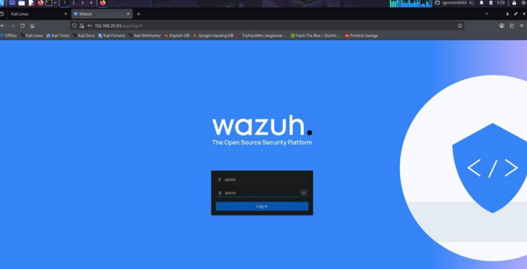
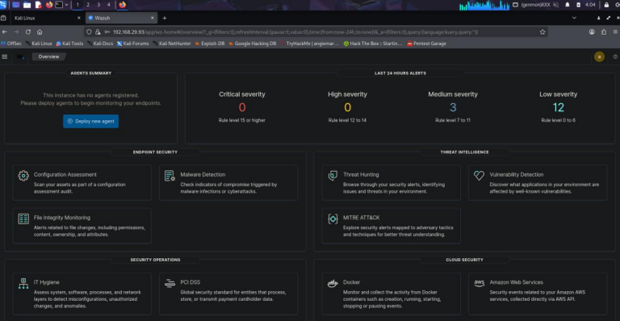
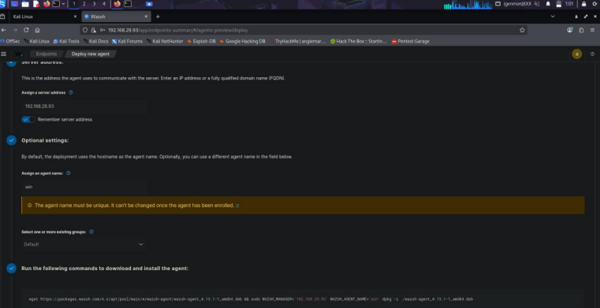
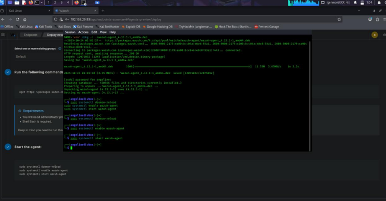
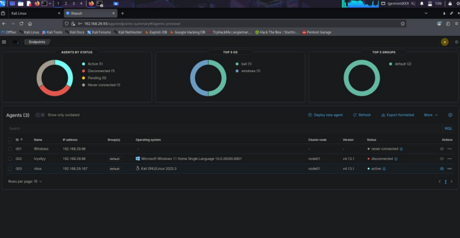
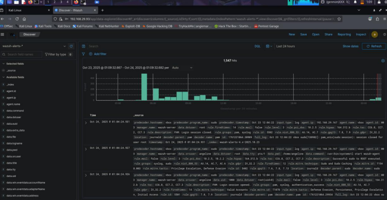
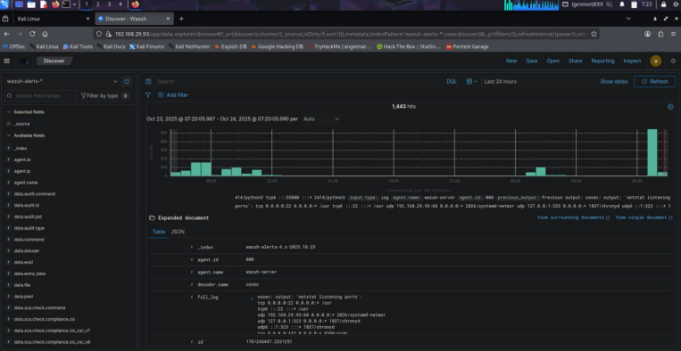

# Wazuh SIEM Deployment & Log Monitoring Lab
This project focuses on deploying and configuring Wazuh, an open-source SIEM platform, to collect, monitor, and analyze security logs from Kali Linux systems in real time.

> This lab replicates a basic SOC workflow by simulating endpoint log collection, ingestion, and analysis within a centralized SIEM.

## The setup includes:

Wazuh Manager – Central SIEM server for log processing   

Wazuh Agent (Kali Linux) – Endpoint for log collection   

Wazuh Dashboard – Visualization and monitoring interface  

## Objective
- Deploy a functional SIEM environment
  
- Configure secure log forwarding from endpoint to SIEM
  
- Validate log ingestion and visibility
  
- Analyze system-level security events  

## Architecture
Kali Linux (Agent) -> Wazuh Agent -> Wazuh Manager (VM) -> Wazuh Indexer + Dashboard

## Hardware and Software Requirements
### Hardware Requirements
- 4–8 GB RAM

- Dual-core CPU

- 50 GB storage

### Software Used
- Wazuh Manager (OVA)

- Kali Linux (Agent machine)

- VirtualBox

## Deployment Steps
### Wazuh Manager Setup
1. Download Wazuh OVA:

     https://packages.wazuh.com/4.x/vm/wazuh-4.13.1.ova

2. Import into VirtualBox:
     Open VM and from the top menu: Go to File → Import Appliance

     In the Import dialog: click the folder icon and select the downloaded wazuh-4.13.1.ova file, Review the VM settings and click Import.

   
    
   

4. Configure:

     RAM: 4–8 GB
   
     CPU: 2–4 cores
   
     Network: Bridged Adapter

5. Start the imported Wazuh Manager VM:

     Log in using the default username/password provided. Run the command below and note down the IP
   

        ifconfig

   

   

   

7. Access Dashboard:
     Open the web browser on the Kali Linux VM and navigate to the Wazuh Webpage using the IP address

     Login using Default credentials:
   
         username: admin
   
         password: admin

   

   

   
### Wazuh agent setup on kali linux
1. Navigate to Wazuh Dashboard and deploy new agent. Copy-paste the given commands into the terminal and run it:
   

    

    

2. Verify Agent Connection:
   
    Check agent status in dashboard
   
    Expected: Active

    

    
The agent’s Active status in the Wazuh dashboard shows that it has been successfully deployed as expected and is effectively communicating with the Wazuh Manager.

### Log collection and verification 
1. Logs are verified via:
       Dashboard → Explore → Discover

    

    

    
The logs captured system activities such as user logins, command executions, and security events from the Kali Linux machine, were successfully transmitted to the Wazuh Manager for analysis and categorization.

This confirms:

   Agent → Manager communication ✅

   Successful log ingestion ✅

   Event indexing & visibility ✅

## Key Observation
- User login activity (successful & failed)
  
- Command execution logs
  
- System-level security events

## Validation Results
- Agent → Manager communication: Successful
  
- Log ingestion: Confirmed
  
- Event indexing and searchability: Verified
  
### This setup enables:

> Centralized log monitoring

> Detection of suspicious activity

> Real-time visibility into endpoint behavior

### Aligned with SOC Analyst (Tier 1) tasks:

> Log monitoring

> Event triaging

> Basic incident detection
  
## Challenges Faced 

| Issue                   | Cause                | Fix                         |
| ----------------------- | -------------------- | --------------------------- |
| Agent not connecting    | IP mismatch          | Reconfigured manager IP     |
| Logs not visible        | Delay/indexing issue | Restarted services          |
| Dashboard access issues | Network config       | Switched to bridged adapter |

## Learned
Developed an understanding of SIEM architecture and workflow, gained hands-on experience in log forwarding, performed basic troubleshooting during SIEM deployment, and built a foundation in security monitoring and analysis.
